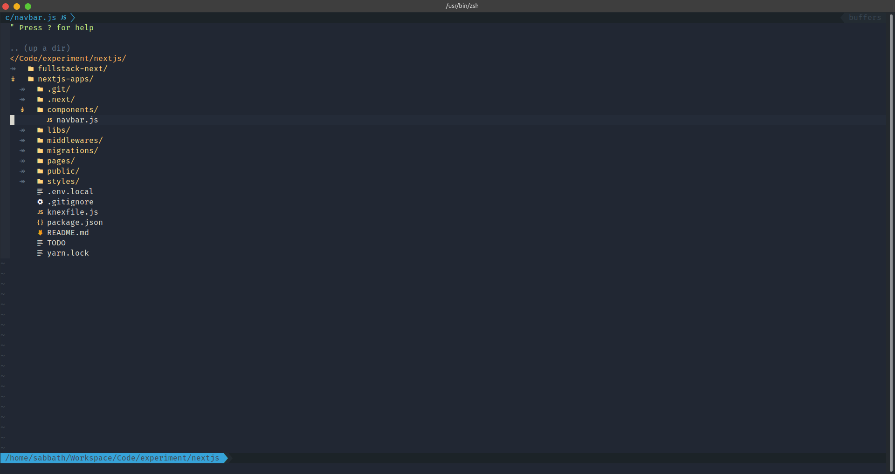
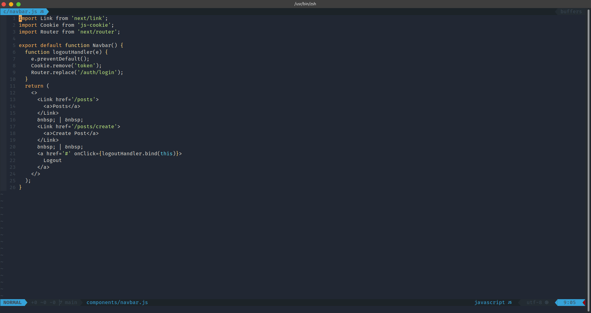
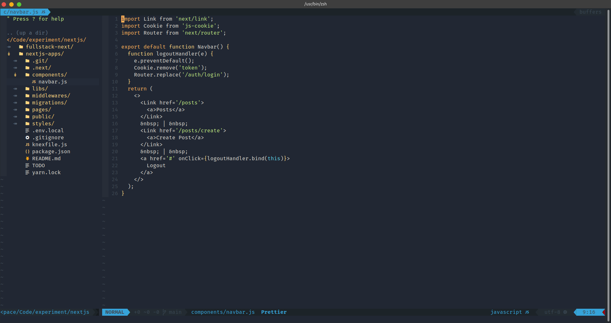

# Rifki's Neovim init.vim

Open project vim.



Normal usage.



Multi-windowed editing with NerdTree.



## Installing and Updating

### Install

#### Automated Installation

Run `./install.sh`

#### Manual Installation

```sh
#!/bin/bash -e

# Make config directory for Neovim's init.vim
mkdir -p ~/.config/nvim

# Install nvim (and its dependencies: pip3, git), Python 3 and ctags (for tagbar)
sudo apt update
sudo apt install neovim python3 python3-pip git curl exuberant-ctags -y

# Install the latest stable Node.js; may not work on Windows.
curl -sL install-node.now.sh | sh

# Install Yarn — required when building from source.
curl --compressed -o- -L https://yarnpkg.com/install.sh | bash

# Install pip modules for Neovim within the virtual environment created
source ~/.config/nvim/env/bin/activate
pip install neovim==0.2.6 jedi psutil setproctitle yapf
deactivate

# Install vim-plug plugin manager
curl -fLo ~/.local/share/nvim/site/autoload/plug.vim --create-dirs https://raw.githubusercontent.com/junegunn/vim-plug/master/plug.vim

# Install powerline-fonts
sudo apt-get install fonts-powerline

# (Optional) Alias vim -> nvim
echo "alias vim='nvim'" >> ~/.bashrc

# Enter Neovim and install plugins using a temporary init.vim, which avoids warnings about missing colorschemes, functions, etc
sed '/call plug#end/q' init.vim > ~/.config/nvim/init.vim
nvim -c ':PlugInstall' -c ':UpdateRemotePlugins' -c ':qall'
rm ~/.config/nvim/init.vim

# Copy init.vim in current working directory to nvim's config location ...
cp init.vim ~/.config/nvim/
```

### Update

Update plugins (super simple)

```
nvim
:PlugUpdate
```

(Optional) Clean plugins - Deletes unused plugins

```
nvim
:PlugClean
```

(Optional) Check, download and install the latest vim-plug

```
nvim
:PlugUpgrade
```

(Optional) Pull my updates if you want my new modifications

```sh
git pull
cp init.vim ~/.config/nvim/
```

## Configure

### coc.nvim uses jsonc as configuration file format, the same as VSCode. It's json that supports comments, like:

```sh
{
    "suggest.noselect": false,
    "coc.preferences.formatOnSaveFiletypes": [
      "javascript",
      "typescript",
      "typescriptreact",
      "json",
      "javascriptreact",
      "typescript.tsx",
      "graphql"
    ]
  }
```
